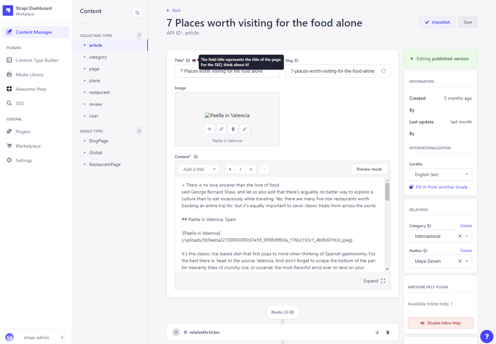
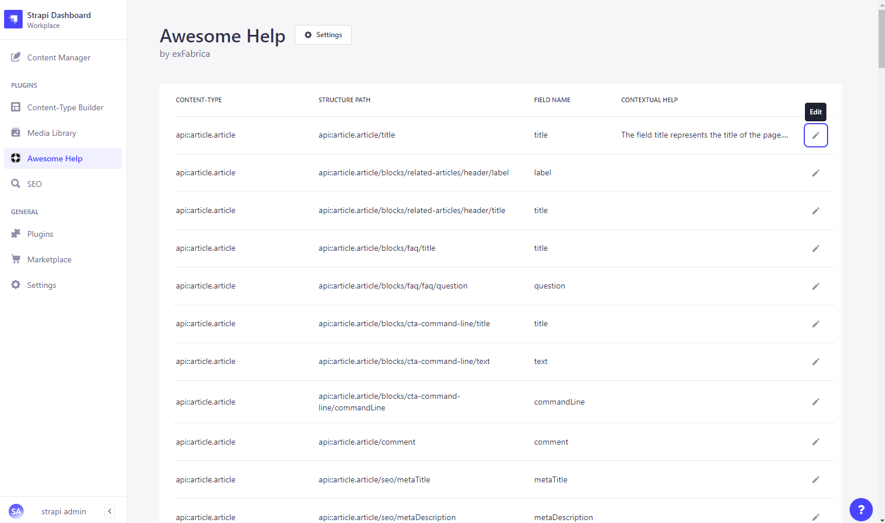
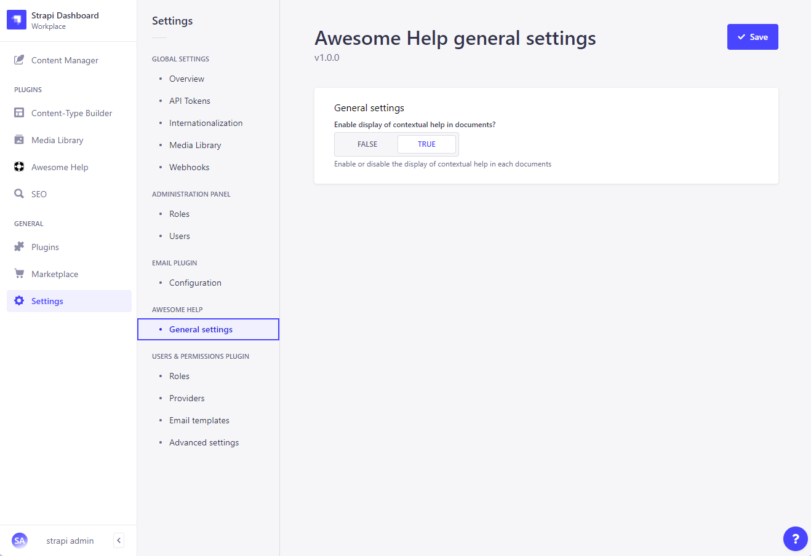

# Strapi plugin Awesome Help

*This plugin is not intended to be used in production.*
*This is a learning aid. Nevertheless, we will try to go as far as possible in its design and deployment.*

This plugin includes all code you need to follow this technical articles: 
[A Strapi plugin from scratch to production](https://medium.com/p/a6deeaf553de)

- [DESCRIPTION](#description)
- [FEATURES](#features)
- [INSTALLATION](#installation)
- [CONFIGURATION](#configuration)


## DESCRIPTION  
The purpose of this plugin is to display an icon on each form label present in each document to display contextual help. 
When the user over the icon, the plugin displays a tooltip with a helpful text.





## FEATURES  
* Add contextual Help on your Strapi documents.
* Scan the Strapi Structure to get all textual and numerical fields.

## INSTALLATION  

```bash
#npm
npm install @exfabrica/strapi-plugin-awesome-help
```
```bash
#yarn
yarn add @exfabrica/strapi-plugin-awesome-help
```
## CONFIGURATION  
Just go inside the general settings of Awesome Help to enable / disable the contextual help.

